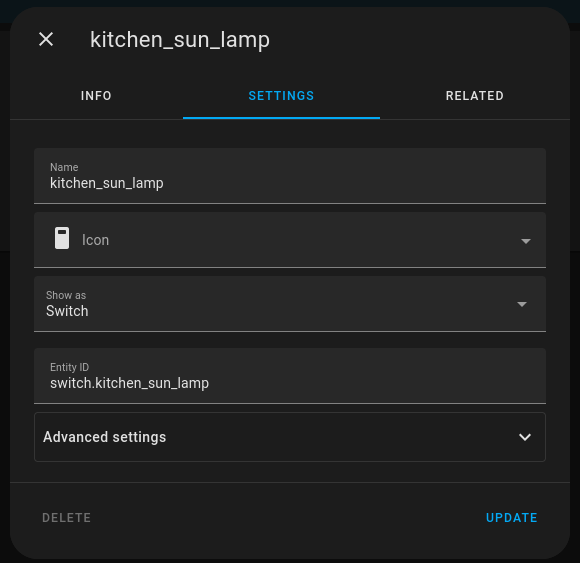

# homeassistant cli

A small cli wrapper for the homeassistant rest api.

_Prerequisites:_
To set it up you should be using [`pass`](https://www.passwordstore.org/).

Generate a bearer token for the rest api ([docs](https://developers.home-assistant.io/docs/api/rest/)).

Insert it into the password store:
```sh
pass insert homeassistant/<hostname>_token
```

For each toggle you will need to obtain the entity_id from the service. This can be accessed from the "overview" tab on the home assistant ui in and the entity_id textfield on the desired switch.



<!-- TODO: update this to use a configuration file instead -->
Update the hashmap of alias to the entity_id.
